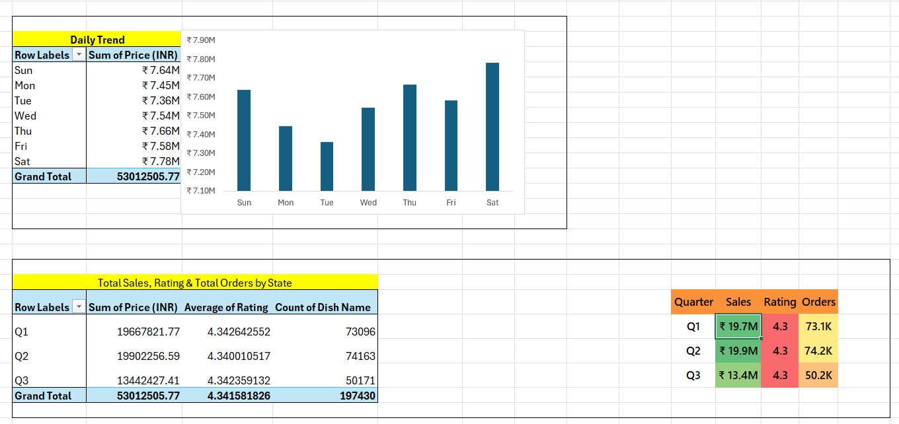
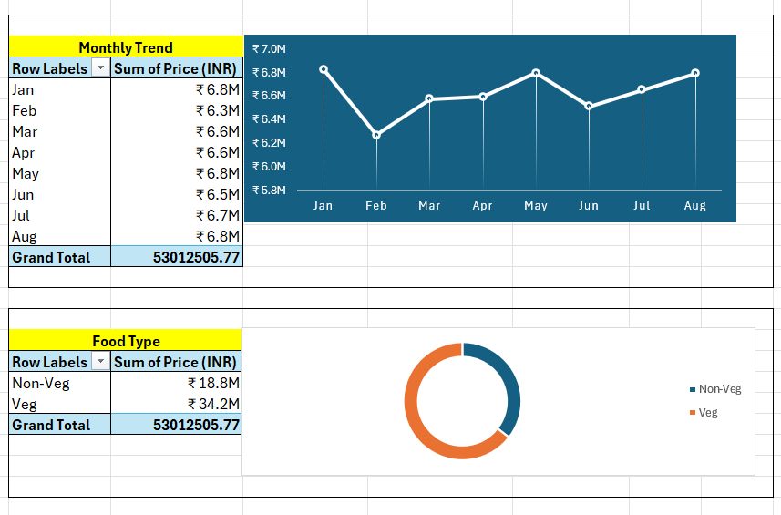
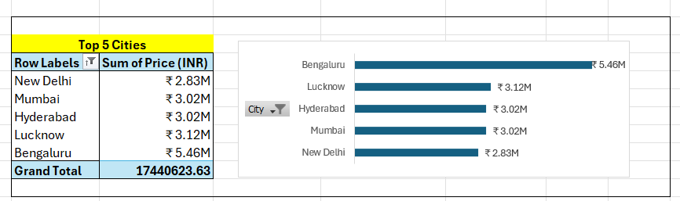
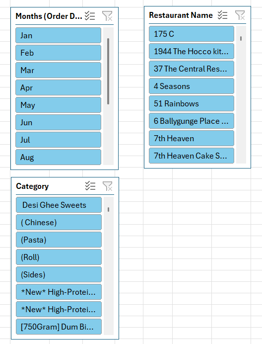
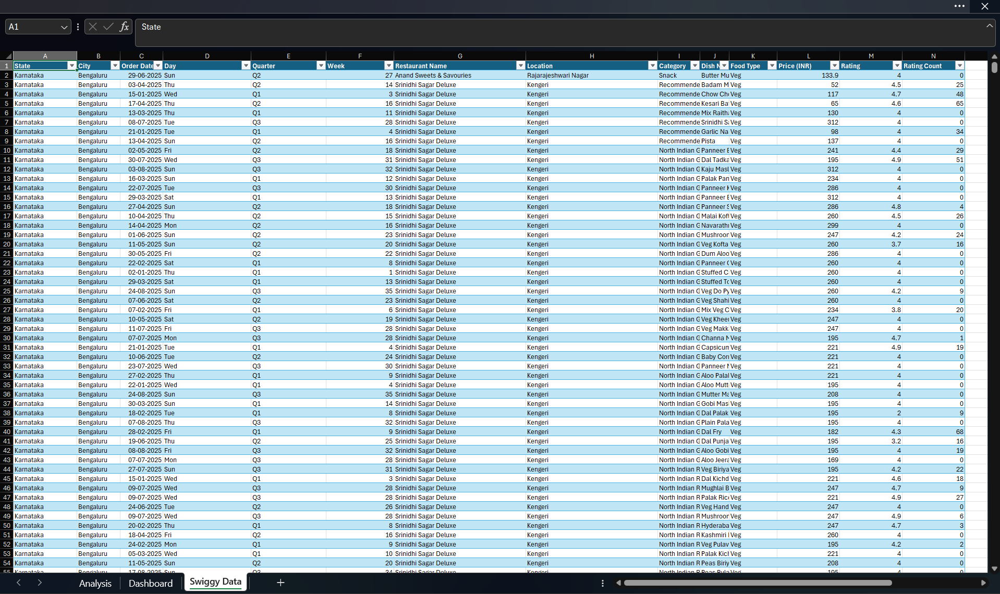

# 🍔 Swiggy Sales Dashboard

An interactive Microsoft Excel dashboard built to analyze Swiggy sales performance using Pivot Tables, Pivot Charts, KPI Cards, Slicers, and Data Visualization.

---

# 📌 Project Overview

This project analyzes Swiggy sales data to uncover valuable business insights such as sales performance, customer ratings, food category trends, city-wise sales, and state-wise performance. The dashboard converts raw data into meaningful visual reports for better business decision-making.

---

# 🎯 Business Objective

The objective of this dashboard is to help businesses understand:

- Overall Sales Performance
- Total Orders
- Average Customer Rating
- Average Order Value
- Daily & Monthly Sales Trends
- Food Category Performance
- Top Performing Cities
- State-wise Sales Analysis

---

# 🛠️ Tools Used

- Microsoft Excel
- Pivot Tables
- Pivot Charts
- KPI Cards
- Slicers
- Conditional Formatting
- Data Cleaning
- Data Visualization

---

# 📊 Main Dashboard

---

# 📈 Dashboard Screenshots

## 📅 Daily Sales Trend

---

## 📆 Weekly Analysis

---

## 🍕 Monthly Trend & Food Type

---

## 🏙️ Top 5 Cities

---

## 🗺️ State-wise Analysis

---

## 📊 KPI Dashboard

---

## 🎛️ Interactive Slicer

---

## 📂 Dataset Preview

---

# 💡 Key Insights

- Identified overall sales performance and customer order trends.
- Compared daily and monthly sales patterns.
- Analyzed food category contribution to total sales.
- Identified top-performing cities based on sales.
- Evaluated state-wise sales distribution.
- Tracked customer ratings and average order value using KPI Cards.

---

# 🚀 Skills Demonstrated

- Data Cleaning
- Data Analysis
- Dashboard Design
- Business Intelligence
- Data Visualization
- KPI Reporting
- Interactive Dashboard Development
- Microsoft Excel Reporting

---

# 📁 Files Included

- Swiggy_Sales_Analysis.xlsx
- Swiggy_Sales_Raw_Data.xlsx
- Dashboard Images

---

# 🚀 Future Improvements

- Power Query Automation
- Advanced Excel Dashboard
- Dynamic Excel Reports
- Interactive Business Reports

---

# 👨‍💻 Author

**Ayush Shedge**

🎯 Aspiring Data Analyst

---

# 📬 Connect With Me

- **GitHub:** https://github.com/ayushshedge24-tech
- **LinkedIn:** https://www.linkedin.com/in/ayush-shedge-analytic

---

⭐ If you found this project useful, consider giving it a **Star!**
