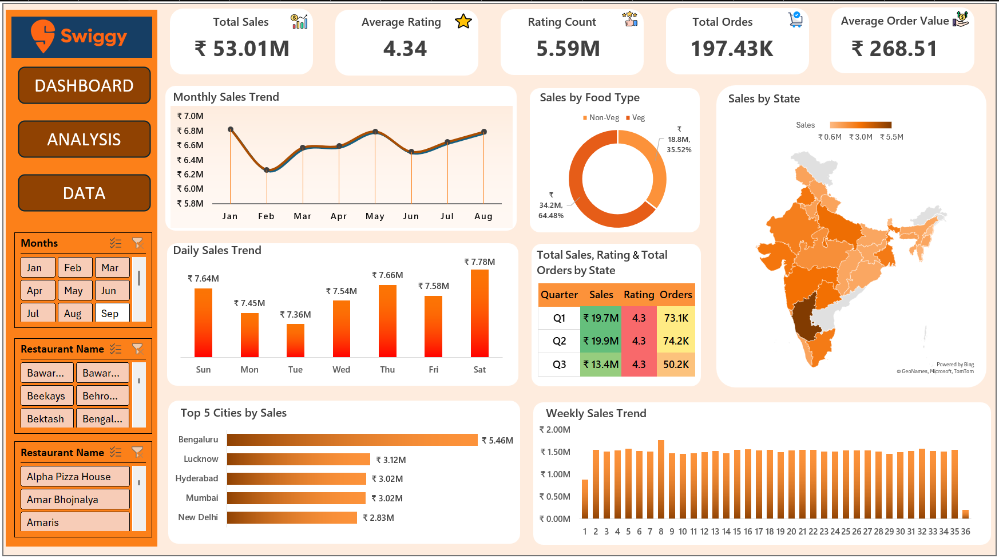
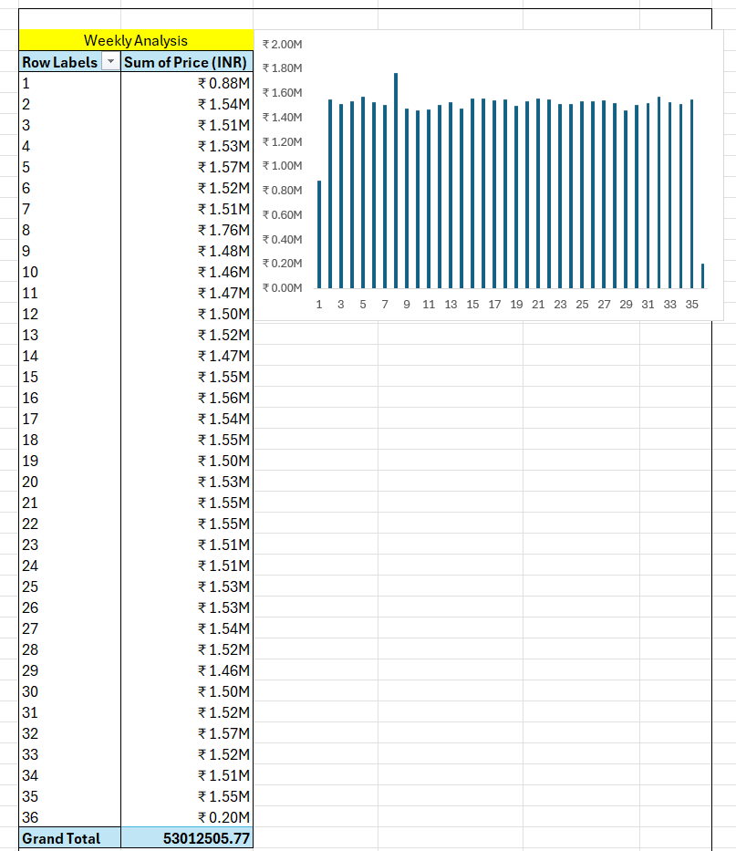
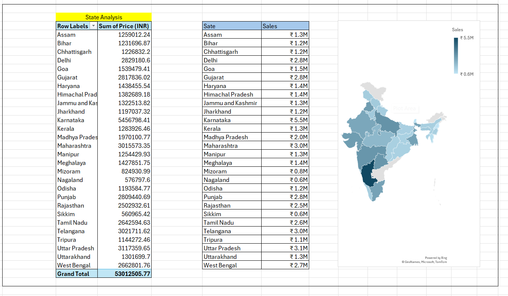
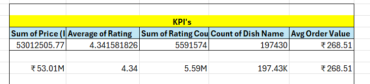

# 🍔 Swiggy Sales Dashboard

An interactive Microsoft Excel Dashboard built using Pivot Tables, Pivot Charts, KPI Cards, and Slicers.

---

# 📌 Project Overview

This project analyzes Swiggy sales data and provides interactive business insights using Microsoft Excel.

---

# 🖥️ Main Dashboard

---

# 📊 Dashboard Features

- 📈 Total Sales
- 🛒 Total Orders
- ⭐ Average Rating
- 💰 Average Order Value
- 📅 Daily Sales Trend
- 📆 Monthly Sales Trend
- 🍕 Food Category Analysis
- 🏙️ Top 5 Cities
- 🗺️ State-wise Analysis
- 🎯 KPI Cards
- 🎛️ Interactive Slicers

---

# 📸 Dashboard Screenshots

## 📅 Weekly Analysis

---

## 🏙️ Top 5 Cities

---

## 🗺️ State Analysis

---

## 📈 Daily Trend

---

## 📆 Monthly Trend & Food Type

---

## 📊 KPI Cards

---

## 🎛️ Interactive Slicer

---

# 🛠️ Tools Used

- Microsoft Excel
- Pivot Tables
- Pivot Charts
- Slicers
- Conditional Formatting
- Data Cleaning

---

# 🚀 Skills Demonstrated

- Data Cleaning
- Data Analysis
- Dashboard Development
- Business Intelligence
- Data Visualization
- KPI Reporting
- Interactive Dashboard Design

---

# 📂 Project Files

- 📊 Swiggy Sales Analysis.xlsx
- 📄 Swiggy Raw Data Excel (1).xlsx

---

# 👨‍💻 Author

**Ayush Shedge**

Aspiring Data Analyst

**Skills:** Excel • SQL • Power BI • Python
